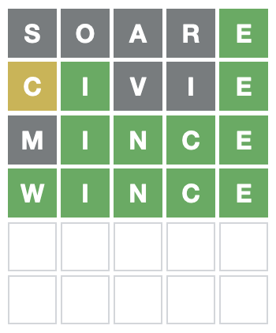

# Solve Wordle with a Bang!

This script attempts to solve todays Wordle.

To run it install https://jbang.dev/downloads[jbang]:
```
curl -Ls https://sh.jbang.dev | bash -s - app setup
```

And then run:

```
jbang main@maxandersen/wordle-solve
```

This will then use https://playwright.dev/[Playwright] to interact with https://www.powerlanguage.co.uk/wordle/ and if right word is found
save a screenshot of the board and copy a shareable wordle into your clipboard.

== Example

```
Wordle 217 4/6
⬜⬜⬜⬜🟩
🟨🟩⬜⬜🟩
⬜🟩🟩🟩🟩
🟩🟩🟩🟩🟩
```



== Thanks

Based on the logic in https://github.com/DasBrain/playwright-wordle, but just stripped down to the bare necessities for running it with JBang.
